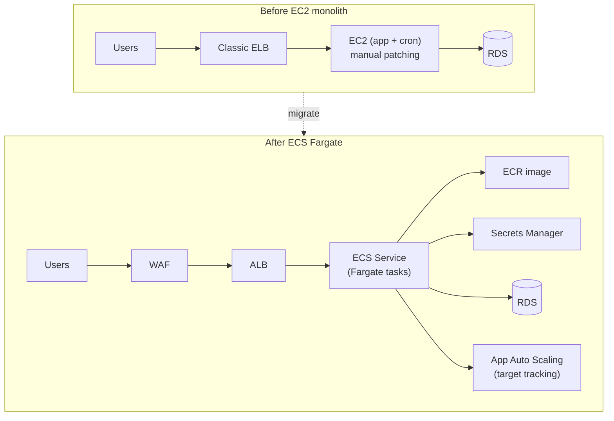

# ecs-fargate-migration

[](https://aws.amazon.com/fargate/)
[](https://www.terraform.io/)
[](https://www.docker.com/)
[](LICENSE)

Reference implementation for migrating an **EC2-hosted monolith** to **containers on
AWS ECS Fargate**  with Terraform for everything: VPC, ALB + WAF, ECR, ECS service/task
definitions, autoscaling, and credentials in Secrets Manager. No servers to patch.

> Based on a migration I led: moving EC2 monolith workloads to ECS Fargate to improve
> deployment consistency, cut infra-related incidents, and remove OS-patching/maintenance toil.

## Before → After



## Why Fargate

| Pain on EC2 | Fixed by Fargate |
|-------------|------------------|
| Manual OS patching / AMI bake | No host to patch  AWS manages it |
| "Works on my instance" drift | Immutable image promoted across envs |
| Capacity guesswork | Target-tracking autoscaling on CPU + ALB RPS |
| Snowflake cron box | Scheduled ECS tasks (EventBridge) |
| Slow, risky deploys | Rolling deploy with circuit breaker + auto-rollback |

## What's here

```
docker/                 # Dockerfile + sample app (multi-stage, non-root)
terraform/
  modules/
    network/            # VPC, subnets
    alb-waf/            # ALB + WAFv2 managed rules
    ecs-service/        # cluster, task def, service, autoscaling
  envs/
    staging/
    production/
.github/workflows/      # terraform validate + docker build
```

## Deploy

```bash
# 1. Build & push the image
aws ecr get-login-password | docker login --username AWS --password-stdin "$ECR"
docker build -t "$ECR/orders:1.0.0" docker/
docker push "$ECR/orders:1.0.0"

# 2. Provision
cd terraform/envs/staging
terraform init && terraform apply -var "image=$ECR/orders:1.0.0"
```

## Rollout safety

ECS deployment circuit breaker is enabled with `rollback = true`: a failing task set is
automatically rolled back, and the deployment alarms on ALB 5xx + target health.

## License

MIT © Ayushi Shrotriya
